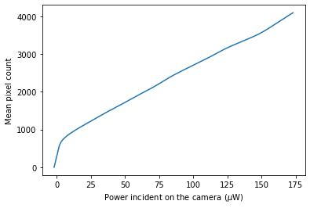
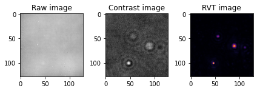
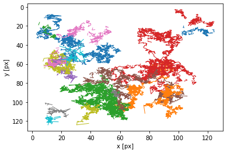
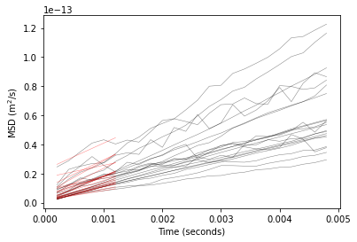
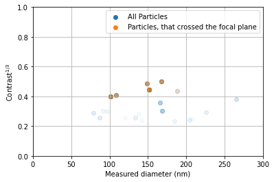

# iNTA analysis procedure. Tutorial.

This notebook will describe the basics of iNTA analysis, starting with raw videos and ending with a plot in which particle iSCAT  is plotted vs. particle size. It will be run on an example dataset, in which liposomes were recorded diffusing in water over 1 second. The total time to run this tutorial is about 2 minutes.

The Jupyter notebook together with the required data can be downloaded at [GitHub](https://github.com/anyakash87/iNTA/releases/download/v1.0/iNTA_tutorial.zip) as a single archive.

First we import necessary python libraries.


```python
import numpy as np
from matplotlib import pyplot as plt
import pandas as pd
from scipy.interpolate import interp1d
from scipy.signal import savgol_filter
import imgrvt as rvt
import trackpy as tp
import pylablib as pll
import math

import warnings
warnings.simplefilter("ignore",category=RuntimeWarning)  # do not display fitting warnings
```

Since we use a Photon Focus camera with a non-linear response to light, we need to perform a power calibration. For that a file was created in which the mean pixel value of the uniformly illuminated field of view was recorded was recorded as a function of the power incident on the camera. That file is interpolated and filtered using a Savitzky–Golay filter to "smooth" the data and a new interpolating function is created.   


```python
df_power=pd.read_csv(r"power_calibration.csv")

Power=interp1d(df_power["Mean_Mean"],df_power["Power"],fill_value="extrapolate",bounds_error=False)
meanrange=np.arange(0,4095)
meany=Power(meanrange)
meanynew=savgol_filter(meany, 501, 3)
Power=interp1d(meanrange,meanynew,fill_value="extrapolate",bounds_error=False)

plt.plot(Power(meanrange),meanrange)
plt.ylabel("Mean pixel count")
plt.xlabel("Power incident on the camera ($\mu$W)")
plt.show()
```





Next we load the raw binary file, recorded from the camera using [pyLabLib Cam Control](https://github.com/SandoghdarLab/pyLabLib-cam-control) software. We record frames with the size of 128x128 pixels and save them as 16 bit unsigned integers. We load those frames and convert them to 32 bit floating point. 


```python
file=r"raw_data.bin"
data=open(file,'rb').read()
rawframes=np.frombuffer(data,"uint16").reshape((-1,128,128)).astype("float32")
```

Photon focus camera has an option of adding status line to each frame. The status line contains information about the frame number lets one ensure that there are no missing frames. [pyLabLib Cam Control](https://github.com/SandoghdarLab/pyLabLib-cam-control) software checks for the missing frames already therefore the status line can be simply removed. 


```python
if np.all(rawframes[0,-1,:4]==[0xFF,0x00,0xAA,0x55]):
    print("Status line detected")
    rawframes[:,-1,:]=rawframes[:,-2,:]
```

    Status line detected
    

The frames are then converted from pixel counts to power using the function that we defined previously. 


```python
frames=Power(rawframes)
```

Next, we will perform a temporal median background correction. For that we simply calculate the temporal median frame. Mean can also be used and is significantly quicker but might have a small effect on the extracted contrast. The temporal median background is then subtracted from every frame in the video. In addition we subtract the median from each row and each column to correct the column and row noise.


```python
medframes=[]
#calculating a temporal median of the whole video
bg=np.median(frames,axis=0)
for i in range(0,len(frames)):
    #subtracting the temporal median from each individual frame
    bg_corr=frames[i]-bg    
    #subtracting the  median from each individual column and row and adding the median of the whole frame
    bg_corr1=bg_corr-np.median(bg_corr,axis=1, keepdims=True)+np.median(bg_corr)
    bg_corr2=bg_corr1-np.median(bg_corr1,axis=0, keepdims=True)+np.median(bg_corr1)
    medframes.append(bg_corr2)
medframes=np.array(medframes)
```

Then we apply [radial variance transform (RVT)](https://github.com/SandoghdarLab/rvt)
to each median background corrected frame. This will take a few seconds.


```python
rvtframes=[]
for i in range(0,len(medframes)):
    rvtframe=rvt.rvt(medframes[i],2,25,kind="normalized",highpass_size=5,coarse_factor=2,coarse_mode="add",pad_mode="fast")
    rvtframes.append(rvtframe)
rvtframes=np.array(rvtframes)
```

Finally we convert the median background corrrected images to "contrast" images by dividing by the the background frame.


```python
conframes=medframes/bg
```

Now we display the raw image, "contrast" image and RVT image.


```python
plt.subplot(1,3,1)
plt.imshow(rawframes[0],cmap="gray")
plt.title("Raw image")

plt.subplot(1,3,2)
plt.imshow(conframes[0],cmap="gray")
plt.title("Contrast image")

plt.subplot(1,3,3)
plt.imshow(rvtframes[0],cmap="inferno")
plt.title("RVT image")
plt.tight_layout()
```





Next, we perform particle tracking on the RVT video using the [trackpy](http://soft-matter.github.io/trackpy/v0.5.0/) package. See the trackpy tutorial for the explanation of how to select the tracking parameters.


```python
tp.quiet(suppress=True)
#locate particles in the rvtframes movie
f = tp.batch(rvtframes, 7 ,minmass=0.5,maxsize=4,separation=9,percentile=0.99,threshold=0)
#filter by eccentricity
f=f[f["ecc"]<0.3]
#link individual particles into trajectories
t = tp.link_df(f, 12, memory=7)
#remove trajectories shorter than 100 points
t1 = tp.filter_stubs(t, 100)
#plot all remaining trajectories
plt.figure()
tp.plot_traj(t1);
```





Renaming the columns in the trackpy dataframe for convenience.


```python
df=t1.rename(columns={"frame": "Frame", "particle": "Particle","x": "X","y": "Y"})
df=df.reset_index()
```

Next, we determine particle iSCAT contrast. It can be determined in several ways. The simplest one simply uses the value of the pixel at the calculated center of the particle. This can be explanded to, for example using a 3x3 pixel average. Those methods are fast, but return erroneous contrast when particle center falls, for example, between two pixels. To mitigate this, we developed a method in which contrast is determined as a weighted sum of the pixels near particle center. The pixels are weighted by the value of the small Gaussian located at the particle cetner. This will take a few seconds.


```python
def apply_weighted_gaussian(smallframe,centerx,centery):
    '''
    Find the pixel value of the image at a certain non-integer position using a weighted Gaussian mask
    Arguments:
        smallframe: image, 2D numpy array
        centerx: x coordinate
        centery: y coordinate
        dimensions: number of spatial dimensions
    
    Returns:
        cont: pixel value of the image
    '''    
    pointsx=np.arange(0,len(smallframe[0]),1)
    pointsy=np.arange(0,len(smallframe),1)
    xx,yy=np.meshgrid(pointsx,pointsy)
    circle=np.array((xx-centerx)**2+(yy-centery)**2)
    data_psf=np.exp(-(circle)/(2**2))
    mask=np.exp(-(circle)/(1**2))
    frame_masked=smallframe*mask
    cont=(np.sum(frame_masked)/np.sum(mask*data_psf))
    return cont
    

for index, row in df.iterrows():
    #extract frame,x,y from the dataframe df
    fn,x,y=int(row["Frame"]),int(round(row["X"])),int(round(row["Y"]))
    #find the coordinates of the 10x10 px cutout taking care not to be outside of the image
    startx,starty=np.max([x-5,0]),np.max([y-5,0])
    endx,endy=np.min([x+5,127]),np.min([y+5,127])
    #generate a small cutout around particle
    smallframe=conframes[fn,starty:endy,startx:endx]
    #find the coordinates of the PSF center in the small cutout
    centerx=df.at[index,"X"]-startx
    centery=df.at[index,"Y"]-starty  
    #calculate the contrast 
    df.at[index,"Contrast"]=apply_weighted_gaussian(smallframe,centerx,centery)    

   
```

Now, that we have contrasts for all points along the trajectory, we can find the maximum value of particle contrast, which is related to its scattering cross-section. However, the iSCAT contrast varies as the particle moves in axial direction. Therefore we need to determine whether the maximum contrast corresponds to the particle being near the focal plane. We, therefore, fit the center of the iPSF with a Gaussian. For this we use the fitting function available in the [pyLabLib](https://github.com/AlexShkarin/pyLabLib) library. We do this for the ten highest contrast values of each particle.


```python
def gaussian(x, y, pos, width, height,offset):
    '''
    Gaussian function
    Arguments:
        x,y: coordinates of each individual pixel
        pos: a tuple, which indicates the center of the gaussian
        width: width of the gaussian
        heigh: height of the gaussian
        offset: background

    Returns:
        the value of the gaussian evalated at x,y positions
    '''  
    return np.exp( -((x-pos[0])**2+(y-pos[1])**2)/(2*width**2) )*height+offset 

for part in np.unique(df.Particle):
    #Select only entries corresponding to the specific particle
    dfsmall=df[df.Particle==part]
    #Sort the dataframe by contrast
    contsort=dfsmall.sort_values(by="Contrast")
    #Select 10 highest contrast values
    res=contsort.tail(10)
    for index, row in res.iterrows():      
        #extract frame,x,y from the dataframe df
        fn,x,y=int(row["Frame"]),int(round(row["X"])),int(round(row["Y"]))
     
        #find the coordinates of the 16x16 px cutout taking care not to be outside of the image
        startx,starty=np.max([x-8,0]),np.max([y-8,0])
        endx,endy=np.min([x+8,127]),np.min([y+8,127])
        #generate a small cutout around particle
        smallframe=conframes[fn,starty:endy,startx:endx]
        #find the coordinates of the PSF center in the small cutout
        centerx=df.at[index,"X"]-startx
        centery=df.at[index,"Y"]-starty  
        
        #Define fit parameters, fixed parameters and limits on the parameters (see pylablib documentation for more info)
        fit_par = {"width":2, "height":smallframe.max(),"offset":0}
        lim_par = { "width":(0,np.inf)}
        fix_par={"pos":[centerx,centery]}
        
        #Fit the data
        fitter = pll.Fitter(gaussian, xarg_name=["x","y"], fit_parameters=fit_par,fixed_parameters=fix_par)
        # building x and y coordinates for the image
        xs, ys = np.meshgrid(np.arange(smallframe.shape[1]), np.arange(smallframe.shape[0]), indexing="xy")
        fitpar,fitfunc,fiterr,resid = fitter.fit([xs,ys], smallframe,return_residual=True, return_stderr=True,limits =lim_par)
        
        #Add the values into the dataframe
        df.at[index,"WGauss_MED"]=fitpar["width"]
        df.at[index,"WGauss_MED_Err"]=fiterr["width"]  

```

We now have our final dataframe that we will analyze and extract both diffusion constant and contrast of each particle. First we need to define relevant parameters of our setup as well as the necessary functions. 


```python
pixelsize=55*10**-9 #pixel size on the camera in m
fps=5000 #frames per second
MSDsteps=25 #Number of steps over which to calculate and display MSD plot
fitpoints=6 #Number of steps over which to fit MSD plot
Temperature=21 #Temperature in C
Viscosity=0.9775*10**-3 #Water viscosity in Pa*s
kB=1.38e-23 #Boltzmann constant

def radius(D,T,eta):
    '''Calculate radius given diffusion constant, temperature and viscosity from Stokes Einstein relation'''
    return kB*(T+273.15)/(6*math.pi*eta*D)


def get_2D_MSD(xarr,yarr,tarr,fps,numsteps):
    '''
    Calculating 2D MSD plot
    Arguments:
        xarr: numpy array of x positons
        xarr: numpy array of y positons
        tarr: numpy array of times 
        fps: frames per second for the recording
        numsteps: number of steps over which to calculate the MSD
   
    Returns:
        steparr: numpy array of time delays in the same units as tarr
        MSDarr: numpy array of MSD in the same units as xarr and yarr
    ''' 
    MSDarr=[]
    steparr=[]
    iarr=np.round((tarr-tarr[0])*fps).astype(int)
    tlen=iarr[-1]+1
    fxarr=np.zeros(tlen)
    fyarr=np.zeros(tlen)
    varr=np.zeros(tlen,dtype="bool")
    fxarr[iarr]=xarr
    fyarr[iarr]=yarr
    varr[iarr]=True
    for i in range(1,numsteps):
        xdiff=fxarr[i:]-fxarr[:-i]
        ydiff=fyarr[i:]-fyarr[:-i]
        vxdiff=xdiff[varr[i:]&varr[:-i]]
        vydiff=ydiff[varr[i:]&varr[:-i]]
        MSD=np.mean(vxdiff**2+vydiff**2)
        MSDarr.append(MSD)
        steparr.append(i/fps)
    steparr=np.array(steparr)
    MSDarr=np.array(MSDarr)
    return steparr,MSDarr

def linear_fit_MSD(steparr,MSDarr,maxstepsize,dimensions=2):
    '''Perform linear fit on to the MSD plot
    Argument:
        steparr: array of time delays
        MSDarr: array of msds
        maxstepsize: the maximum step size we use for the fit
        dimensions: number of spatial dimensions
    
    Returns:
        Dlin: Diffusion constant
        SigmaSqlin: Y-intercept (related to the motion blur and localization error)
        linMSD: the fit function
    '''
    arrpoly=np.polyfit(steparr[0:maxstepsize],  MSDarr[0:maxstepsize], 1)
    Dlin=arrpoly[0]/(dimensions*2)
    SigmaSqlin=arrpoly[1]
    linMSD=4*Dlin*steparr[0:maxstepsize]+SigmaSqlin
    return Dlin,SigmaSqlin,linMSD

```

Now we iterate over all trajectories in the dataframe and find the diffusion constant and maximum contrast.


```python
#Sort dataframe py particle and frame
df.sort_values(['Particle', 'Frame'], ascending=[True, True], inplace=True)
#Define a new dataframe to store results
dfresult=pd.DataFrame()
#Iterate over the dataframe
for part in df.Particle.unique():
    dfsmall1=df.loc[df['Particle'] == part]
    dfsmall=dfsmall1.reset_index(drop=True)
    if len(dfsmall)>MSDsteps:
        #Create a smaller dataframe "dfcont" which only includes data for which the iPST fit to a Gaussian worked out well
        dfcont=dfsmall[dfsmall.WGauss_MED*pixelsize*10**9<500]
        dfcont=dfcont[dfcont.WGauss_MED*pixelsize*10**9>25]
        dfcont=dfcont[dfcont.WGauss_MED_Err>0]
   
        if len(dfcont)>1:
            #Find the maximum contrast of "dfcont", and the corresponding  gaussian width and gaussian width error
            maxcont=dfcont.loc[dfcont["Contrast"].idxmax()]
            cval=maxcont["Contrast"]
            cval_WGauss=maxcont["WGauss_MED"]
            cval_WGauss_err=maxcont["WGauss_MED_Err"]
    
            #Get numpy arrays from the dataframe
            frametraj=np.array(dfsmall["Frame"])
            xtraj=np.array(dfsmall["X"])
            ytraj=np.array(dfsmall["Y"])
            #Calculate MSD
            steparr,MSDarr=get_2D_MSD(xtraj*pixelsize,ytraj*pixelsize,frametraj/fps,fps,MSDsteps)
            #Fit MSD
            Dlin,SigmaSqlin,linMSD=linear_fit_MSD(steparr,MSDarr,fitpoints)
            #Append the results to the dfresult dataframe                       
            temp = pd.DataFrame(
                {   'Length': [len(dfsmall)],
                    'Contrast**(1/3)': [cval**(1/3)],
                    'Dlin': [Dlin],
                    'Diameter_nm': [radius(Dlin,Temperature,Viscosity)*10**9*2],
                    'Width_nm': [cval_WGauss*pixelsize*10**9],
                    
                }
            )                
            dfresult = pd.concat([dfresult, temp])
            #Plot the MSD plots and fits
            plt.plot(steparr,MSDarr,'k-',alpha=0.5,lw=0.5)
            plt.plot(steparr[0:fitpoints],linMSD,'r-',alpha=0.5,lw=0.5)
dfresult.reset_index(inplace=True)    
plt.xlabel("Time (seconds)")
plt.ylabel("MSD (m$^2$/s)")
plt.show()
```





Finally we just need to plots the results. We determined that particles with the widthof central iPSF lobe between 100 and 130 nm have crossed the focal plane and therefore have their contrast precisely determined. Therefore, we can choose to only plot those particles. 


```python
#Scale the number of entries in dfresult by the length of the trajectory
dfresult_scaled = dfresult.loc[dfresult.index.repeat(round(dfresult['Length']/100))].assign(fifo_qty=1).reset_index(drop=True)
#Creat a new dataframe which only contains particles that have at some point crossed the focal plane
#(width of the central iPSF lobe is between 100 and 130 nm)
dfresult_scaled_cross=dfresult_scaled[dfresult_scaled["Width_nm"]>100]
dfresult_scaled_cross=dfresult_scaled_cross[dfresult_scaled_cross["Width_nm"]<130]

#Plot all the data (blue) and data corresponding to particles that have crossed the focal plane.  
plt.scatter(dfresult_scaled["Diameter_nm"],dfresult_scaled["Contrast**(1/3)"],alpha=0.03,label ="All Particles")
plt.scatter(dfresult_scaled_cross["Diameter_nm"],dfresult_scaled_cross["Contrast**(1/3)"],alpha=0.03,label ="Particles, that crossed the focal plane")
plt.xlim(0,300)
plt.ylim(0,1)
plt.grid()

leg = plt.legend()
for lh in leg.legendHandles: 
    lh.set_alpha(1)
plt.xlabel("Measured diameter (nm)")
plt.ylabel("Contrast$^{1/3}$")
plt.show()
```





This tutorial was demonstrated on a single 1 second long video. However one can see the semblance to the plot shown in the Figure 4a of the manuscript already. Generally the data is accumulated over several seconds or even minutes, resulting in multiple one-second long videos. Those videos are analyzed as described above and the results are all plotted together. 
